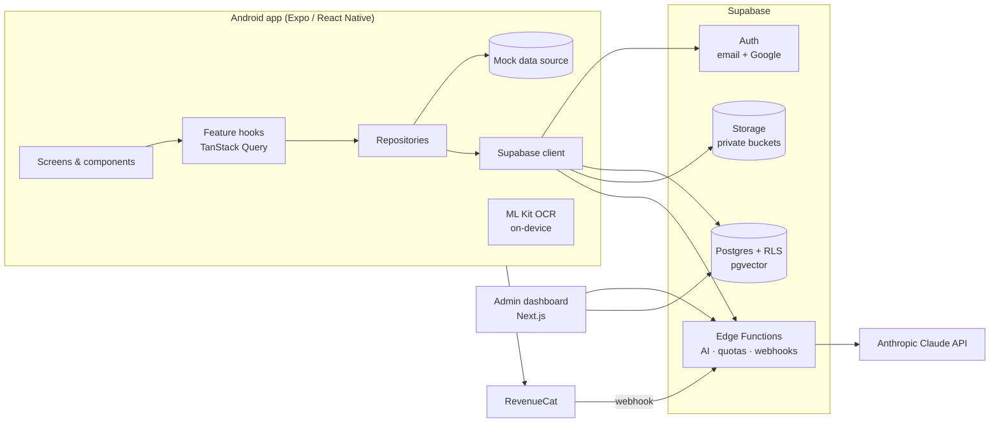

# Studexa — Architecture

Studexa is an AI study assistant for Android. This document is the blueprint every
implementation phase follows. Decisions are recorded with their reasoning in
[Decision log](#decision-log).

## System overview



Key properties:

- **The app never holds a secret.** It ships only the Supabase URL + anon key (public by
  design) and the RevenueCat public key. The Anthropic key, Supabase service-role key and
  webhook secrets exist only in Edge Function secrets.
- **Authorization lives in the database.** Every table has Row Level Security; a bug in
  client code cannot expose another user's data.
- **All AI traffic goes through Edge Functions**, which authenticate the user, check quotas
  from `plan_limits`, rate-limit, call Claude, record usage, and return validated output.
- **Limits are data, not code.** Free/Premium quotas live in the `plan_limits` table and are
  edited from the admin dashboard; the app reads them at runtime, so no release is needed.

## Repository layout

```
.
├── apps/
│   ├── mobile/          Expo SDK 57 Android app (this phase)
│   └── admin/           Next.js admin dashboard (Phase 5)
├── packages/
│   └── shared/          Types, zod schemas and constants shared by app, admin and functions
├── supabase/
│   ├── migrations/      Versioned SQL migrations (Phase 2)
│   ├── functions/       Edge Functions (Phase 5–6)
│   └── seed.sql         Local/dev seed data
├── docs/                Architecture, API, database, deployment, maintenance
└── .github/workflows/   CI: format, typecheck, lint, test
```

Tooling: **pnpm workspaces + Turborepo**, TypeScript **strict** everywhere (plus
`noUncheckedIndexedAccess` and `exactOptionalPropertyTypes`), Prettier, ESLint.

`packages/shared` is the single source of truth for cross-cutting contracts — plan tiers and
limit shape, AI actions, supported locales and file types, error codes. The app, the admin
dashboard and the Edge Functions all import it, so a contract change is a compile error
everywhere it matters instead of a runtime bug.

## Mobile app

### Layers (Clean Architecture, feature-first)

```
apps/mobile/src/
├── app/                 Routes only (Expo Router). Each file re-exports a feature screen.
├── core/                App-wide infrastructure, no feature knowledge
│   ├── config/          Validated env (zod) + automatic mock mode
│   ├── i18n/            i18next, en/ar/fr resources, RTL handling
│   ├── theme/           Design tokens, ThemeProvider, useStyles
│   ├── query/           TanStack Query client + retry policy
│   ├── storage/         Persisted preferences (SQLite KV)
│   └── providers/       Provider composition
├── shared/ui/           Reusable, feature-agnostic components
└── features/<feature>/
    ├── domain/          Entities, repository interfaces, pure use-case logic
    ├── data/            Repository implementations: Supabase + mock
    ├── presentation/    Screens, components, hooks
    └── index.ts         Public API of the feature
```

Dependency rule: `presentation → domain ← data`. Screens depend on repository
_interfaces_; the concrete implementation (Supabase or mock) is selected once, from
`env.useMocks`. Features import each other only through `index.ts` — enforced by ESLint.

Routes stay thin (`export { HomeScreen as default } from '@/features/home'`) so navigation
can be reorganised without touching feature code.

### Planned features

| Feature         | Responsibility                                                              |
| --------------- | --------------------------------------------------------------------------- |
| `auth`          | Email/password, Google sign-in, password reset, session persistence         |
| `home`          | Dashboard: recent files and chats, stats, continue learning, streak         |
| `documents`     | Upload PDF/DOCX/TXT, camera, gallery, rename, delete, search, favorites     |
| `reader`        | Page viewer, bookmarks, "ask about this page"                               |
| `ocr`           | Hybrid OCR (ML Kit on device, Claude vision for Arabic/handwriting)         |
| `ai-tools`      | Explain, summarize, translate, ELI10, notes, mind map, study plan, practice |
| `chat`          | Per-document conversations grounded in the document, search, delete         |
| `quiz`          | MCQ / true-false / short answer, timed mode, scoring, review                |
| `flashcards`    | Generated decks, known/unknown, spaced repetition (FSRS)                    |
| `notes`         | CRUD, pin, search                                                           |
| `voice`         | Read summaries aloud (expo-speech)                                          |
| `notifications` | Daily and study reminders (expo-notifications)                              |
| `settings`      | Language, theme, notifications, account, privacy, subscription              |
| `subscription`  | RevenueCat paywall, entitlement state, usage meters                         |

### State management

| Kind                       | Tool                             | Why                                          |
| -------------------------- | -------------------------------- | -------------------------------------------- |
| Server data                | TanStack Query                   | Caching, dedup, retries, pagination, offline |
| Local preferences          | Zustand + `expo-sqlite/kv-store` | Tiny, synchronous hydration (no flash)       |
| Auth tokens                | `expo-secure-store` (Phase 3)    | Android Keystore-backed encryption           |
| Offline document/text data | `expo-sqlite` (Phase 4+)         | Queryable local cache                        |

The query client never retries `unauthenticated`, `forbidden`, `not_found`,
`validation_failed` or `quota_exceeded` errors — retrying cannot fix them.

### Design system

- Tokens in `core/theme/tokens.ts`: colors (light + dark), spacing, radii, typography,
  motion. Brand blue `#0066FF` comes from the Studexa mark; on dark backgrounds brand-colored
  _text_ uses `#5C9DFF` to keep WCAG AA contrast.
- Styling uses `StyleSheet` + tokens via `useStyles(makeStyles)` — no runtime styling engine.
- Layout uses logical properties (`start`/`end`, `marginStart`) so Arabic mirrors correctly.
- Theme preference: system / light / dark, persisted.
- Icons: Material Community Icons (Material Design, ships with Expo).

### Internationalisation

- UI locales: **English, Arabic (RTL), French**. English is the typed source; `ar` and `fr`
  must match its shape (`Translations` type) and a test verifies no key is missing or blank.
- Device language is used unless the user picks one. Switching between LTR and RTL requires
  an app restart on Android; `changeLocale()` reports this so Settings can prompt and reload.
- AI translation supports many more languages (`TRANSLATION_LANGUAGES` in shared).

### Mock mode

When `EXPO_PUBLIC_SUPABASE_URL`/`ANON_KEY` are absent (or `EXPO_PUBLIC_USE_MOCKS=true`), the
app runs entirely on in-memory mock repositories and shows a "Demo mode" badge. Every feature
is built against the repository interface first, so it works end-to-end before credentials
exist and switches to production by setting env vars — no code changes.

## Backend (Supabase)

### Components

| Component        | Use                                                                         |
| ---------------- | --------------------------------------------------------------------------- |
| Auth             | Email/password (with email confirmation), Google OAuth, password recovery   |
| Postgres         | Normalised schema, RLS on every table, migrations in `supabase/migrations`  |
| pgvector         | Embeddings of document chunks for "answer from my documents only"           |
| Storage          | Private `documents` bucket, path `{user_id}/{document_id}/...`, RLS-guarded |
| Edge Functions   | `ai`, `ingest-document`, `ocr`, `revenuecat-webhook`, `admin-*`             |
| Cron (`pg_cron`) | Usage roll-ups, cleanup of orphaned files, streak maintenance               |

### Request flow for an AI action

1. App calls `functions.invoke('ai', { action, documentId, ... })` with the user's JWT.
2. Function verifies the JWT, validates input with the shared zod schema.
3. Rate limit check (per user, sliding window) → `429 rate_limited`.
4. Quota check against `plan_limits` for the user's tier and today's `usage_events`
   → `402 quota_exceeded` with the remaining counts.
5. For document-grounded actions, retrieve top chunks via pgvector (RLS still applies).
6. Call Claude with a system prompt that restricts answers to the supplied context;
   structured outputs (quiz, flashcards, mind map) are validated against zod schemas.
7. Persist results (quiz, deck, note, chat message) and a `usage_events` row with token
   counts in one transaction; stream text responses back to the app.

### Security model

- **Authentication**: Supabase Auth (JWT, refresh rotation), Google via native sign-in
  (ID token exchange), tokens stored in the Android Keystore via SecureStore.
- **Authorization**: RLS (`auth.uid() = user_id`) on all user tables; admin access via a
  `role` claim checked by `is_admin()` in policies and functions.
- **SQL injection**: no string-built SQL — PostgREST parameterises; functions use
  parameterised queries only.
- **XSS**: the app renders text natively (no WebView HTML from AI output); the admin
  dashboard relies on React escaping and a strict Content-Security-Policy.
- **CSRF**: APIs use bearer tokens, not cookies. The admin dashboard's cookie session uses
  `SameSite=Strict` and Next.js server actions' origin checks.
- **Secrets**: only in Supabase function secrets / EAS secrets; `.env` files are git-ignored.
- **Uploads**: MIME + extension + size validated on device and again server-side against
  `plan_limits.maxFileSizeMb`; storage paths are namespaced by user id.
- **Encryption**: TLS in transit; Postgres and Storage encrypted at rest by Supabase;
  sensitive columns (e.g. push tokens) encrypted with `pgsodium`/Vault where stored.
- **Abuse**: rate limiting per user and per IP in Edge Functions; Claude spend is bounded by
  quotas and a global daily budget kill-switch in `app_config`.
- **Privacy**: account deletion (Play Store requirement) removes DB rows via cascade and
  storage objects via a function; data export available from Settings.

## AI (Anthropic Claude)

- Called only from Edge Functions using the official Anthropic SDK.
- Model choice per action is configuration (`app_config`), so we can use a fast model for
  chat and a stronger one for study plans, and change either without a release.
- PDFs are parsed server-side into page-indexed text chunks at ingest; page references let
  "Explain this page" and bookmarks target exact pages.
- Prompt caching is used for the document context in multi-turn chats to cut cost/latency.
- Structured outputs (quiz, flashcards, mind map, study plan) are generated as JSON and
  validated with shared zod schemas before being stored.

## Subscriptions

RevenueCat wraps Google Play Billing. The app shows the paywall and reads entitlements;
RevenueCat's webhook calls the `revenuecat-webhook` function, which updates the
`subscriptions` table. The server trusts only the webhook — never the client — for the
user's tier.

## Admin dashboard (Phase 5)

Next.js (App Router) web app deployed separately, authenticated with Supabase Auth and
restricted to `role = admin`. Screens: users, statistics, reports, subscriptions, errors,
AI usage and cost, and the plan-limits editor.

## Performance

- Lists use `FlashList`; images via `expo-image` (memory + disk cache, downsampling).
- Routes are lazily evaluated by Expo Router; heavy features load on first visit.
- Server data cached by TanStack Query with sensible `staleTime`; pagination with cursors.
- Hermes bytecode, React Compiler enabled (automatic memoisation).
- Database: indexes on every foreign key and common filters, cursor pagination, usage
  aggregation in materialised roll-ups instead of counting raw events per request.

## Testing strategy

| Level       | Tooling                                 | Scope                                 |
| ----------- | --------------------------------------- | ------------------------------------- |
| Unit        | Vitest (shared), Jest + jest-expo (app) | Pure logic, schemas, hooks            |
| Integration | Jest + RNTL with mock repositories      | Screens with providers, data flows    |
| Database    | pgTAP via `supabase test db`            | RLS policies, triggers, functions     |
| Functions   | Deno test                               | Edge Functions with mocked Claude     |
| UI / E2E    | Maestro                                 | Critical flows on an Android emulator |

## Build & release

- Variants via `APP_VARIANT`: `development` (`com.studexa.ai.dev`), `preview`
  (`com.studexa.ai.preview`), `production` (`com.studexa.ai`) — installable side by side.
- EAS Build produces the signed **AAB** for Google Play; EAS Update ships JS-only fixes.
- CI runs format, typecheck, lint and tests on every pull request.

## Decision log

| Decision                      | Chosen                             | Why / alternatives considered                                                                                                                         |
| ----------------------------- | ---------------------------------- | ----------------------------------------------------------------------------------------------------------------------------------------------------- |
| Mobile framework              | Expo SDK 57 (React Native 0.86)    | TypeScript requirement rules out native Kotlin; Expo gives CNG, EAS Build (AAB), OTA updates and iOS later for free. Flutter rejected (Dart, not TS). |
| Backend                       | Supabase                           | Chosen by product owner: managed Postgres (relational, migrations, RLS), Auth, Storage, Edge Functions. Faster to ship than a custom NestJS API.      |
| AI provider                   | Anthropic Claude                   | Strong long-document reasoning, native PDF understanding, reliable structured output.                                                                 |
| OCR                           | Hybrid: ML Kit + Claude vision     | ML Kit is free/offline for Latin, CJK; Claude vision covers Arabic and handwriting where ML Kit is weak.                                              |
| Payments                      | RevenueCat over Play Billing       | Play requires Play Billing for digital goods; RevenueCat handles receipt validation and server webhooks.                                              |
| Monorepo                      | pnpm + Turborepo                   | Shared contracts between app, admin and functions without publishing packages. `node-linker=hoisted` for React Native/Gradle compatibility.           |
| Navigation                    | Expo Router (`js-tabs`)            | File-based typed routes and deep links. Stable JS tabs chosen over `unstable-native-tabs`.                                                            |
| Styling                       | Tokens + `StyleSheet`              | Zero runtime cost, strict types, RTL-safe. NativeWind/Tamagui add a build/runtime layer we don't need.                                                |
| Server state                  | TanStack Query                     | Caching, retries, lazy loading, pagination out of the box.                                                                                            |
| Client state                  | Zustand                            | Minimal API; persisted with synchronous SQLite KV so preferences apply on first frame.                                                                |
| i18n                          | i18next + expo-localization        | Mature, typed keys, pluralisation; RTL via `I18nManager`.                                                                                             |
| Plan limits                   | `plan_limits` table + admin editor | Product owner requirement: change quotas without an app release.                                                                                      |
| Credentials not yet available | Env vars + automatic mock mode     | Product owner requirement: build now, add keys later via `.env`.                                                                                      |
