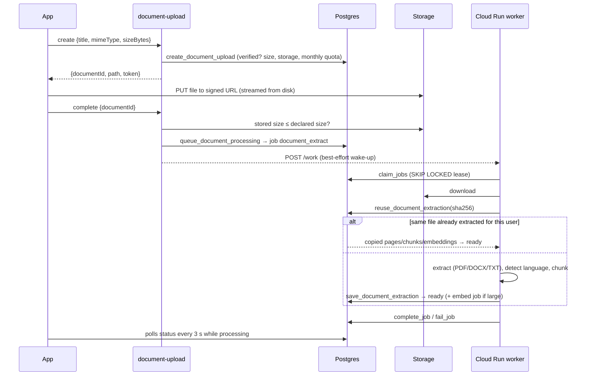

# Studexa — Backend

Phase 5 connects the app to Supabase, adds the document pipeline on Google Cloud Run, billing
webhooks, crash reporting and the admin API. See [DEPLOYMENT](DEPLOYMENT.md) for setup.

## Components

| Component                           | Runs on                 | Purpose                                                          |
| ----------------------------------- | ----------------------- | ---------------------------------------------------------------- |
| `auth-email-code`, `delete-account` | Supabase Edge (Deno)    | Verification/reset codes, account deletion (Phase 3)             |
| `document-upload`                   | Supabase Edge           | Quota check → signed upload URL → confirm → queue extraction     |
| `revenuecat-webhook`                | Supabase Edge           | Store events → subscription state + revenue aggregates           |
| `storage-janitor`                   | Supabase Edge (cron)    | Deletes files of deleted documents/accounts                      |
| `admin-users`                       | Supabase Edge           | Admin-only account actions needing the Auth admin API            |
| `document-processor`                | Google Cloud Run (Node) | Downloads, hashes, extracts, chunks and saves document text      |
| Job queue, config, admin API        | Postgres                | `private.jobs`, `feature_flags`, `announcements`, `admin_*` RPCs |

Edge Functions share `_shared/` (HTTP wrapper, validation with the shared zod contracts, error
mapping, secrets from environment only, rate limiting, telemetry).

## Uploading and processing a document

- **Extract once.** Text is extracted a single time and stored as pages and chunks; every AI
  feature reads the stored text, never the file. Re-uploading an identical file (same SHA-256)
  copies the earlier extraction instead of re-processing it. The cache is per user, so no
  content is ever shared between accounts.
- **Quotas are enforced before any bytes move**, against the declared size; the confirm step
  rejects a larger file than declared (and deletes it), closing the bypass.
- **Retrieval mode** is decided at extraction: up to `retrieval.full_context_max_tokens`
  (100k) the whole text is sent to Claude with prompt caching; larger documents are
  `hybrid` and get an embedding job (processed in Phase 6).
- **Language** (English, French, Arabic) picks the Postgres stemming configuration for
  full-text search; other languages use `simple`.
- **Photos** (`image`): text read on the device arrives with the upload confirmation and is
  saved directly; otherwise the worker reads the photo with Claude vision
  ([AI → OCR](AI.md#ocr-photos)).
- **Embeddings**: hybrid documents get a `document_embed` job; the worker embeds missing chunks
  in batches (resumable). A failed embedding never fails the document — full-text search still
  works.

### Job queue

| Property    | Behaviour                                                                                   |
| ----------- | ------------------------------------------------------------------------------------------- |
| Claiming    | `claim_jobs(kind, worker, limit, lease)` — `FOR UPDATE SKIP LOCKED`, highest priority first |
| Leases      | A crashed worker's jobs are reclaimed when the lease expires                                |
| Retries     | Exponential backoff 30 s · 2ⁿ⁻¹ (max 1 h) with ±20 % jitter, up to `max_attempts` (5)       |
| Permanent   | Corrupt/encrypted/too many pages/no text: dead immediately, document shows the reason       |
| Dead letter | Kept 30 days, counted in `jobs_dead`, visible in the dashboard; admins can retry documents  |
| Dedupe      | One active job per document                                                                 |
| Safety nets | Cloud Scheduler calls `/work` every minute; maintenance fails documents stuck > 15 min      |

The worker processes `WORKER_CONCURRENCY` documents at once per instance, claims in small
batches, stops claiming after `RUN_BUDGET_SECONDS`, and records a heartbeat for the health
page. Cloud Run scales instances with load; `SKIP LOCKED` lets any number of instances share
the queue safely.

### Failure codes shown to users

`too_many_pages`, `password_protected`, `corrupt_file`, `unsupported_file_type`, `no_text`,
`ocr_unavailable`, `ocr_quota_exceeded`, `ocr_declined`, `file_too_large`, `size_mismatch`,
`processing_failed` (retries exhausted), `processing_timeout`.

## Billing (RevenueCat)

The app identifies RevenueCat customers by the Supabase user id. RevenueCat calls
`revenuecat-webhook` with a shared secret in the `Authorization` header;
`apply_billing_event` is:

- **idempotent** — the event id is the primary key of `billing_events`, so retries are no-ops;
- **order-safe** — an event older than the subscription's `last_event_at` is recorded but
  does not change state;
- **the only writer** of subscription state (besides audited manual grants by admins). The
  app never decides the tier; after a purchase it polls until the webhook has landed.

Revenue, trials, renewals, cancellations and expirations are aggregated anonymously in
`analytics.daily_metrics`, so they survive account deletion without personal data.

## Crash reporting and error logging

| Source          | Sentry                                                            | Internal `error_logs` (dashboard)       |
| --------------- | ----------------------------------------------------------------- | --------------------------------------- |
| Android app     | `@sentry/react-native` (native crashes, JS errors, render errors) | Unexpected errors of signed-in users    |
| Edge Functions  | `@sentry/deno`, loaded only when `SENTRY_DSN` is set              | Every unhandled error (`edge_function`) |
| Worker          | `@sentry/node`                                                    | Transient job failures (`worker`)       |
| Admin dashboard | `@sentry/react`                                                   | —                                       |

Expected outcomes (quota reached, invalid code, offline…) are not reported. No personal data is
sent: only the opaque user id, and emails are redacted from log lines. Everything works without
Sentry; add a DSN to enable it.

## Remote configuration

`get_client_config(platform, app_version)` returns, in one cached call (15 min in the app):

- **feature flags** — on/off, gradual rollout by deterministic per-user bucket, platforms,
  minimum app version, plans. Unknown flags default to on in the app, so a config outage never
  removes features;
- **public `app_config`** (legal links, AI kill switch…);
- **announcements** — localised (en/fr/ar), audience (all/free/premium), platforms, version,
  priority, schedule, dismissible.

## Scale notes

- All list endpoints are keyset-paginated; hot paths are single indexed lookups.
- Dashboard statistics read pre-aggregated, sharded daily counters, not raw tables.
- Workers scale horizontally; the queue needs no coordinator.
- Edge Functions are stateless; rate limits and quotas are atomic in Postgres.
