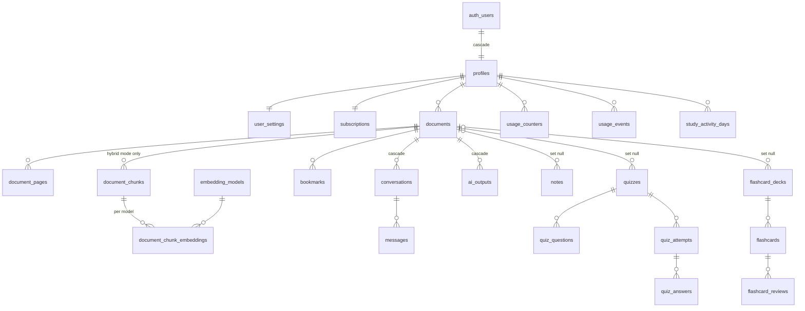

# Studexa — Database

PostgreSQL on Supabase. The schema is defined entirely by the migrations in
[`supabase/migrations`](../supabase/migrations) and verified by 88 pgTAP tests in
[`supabase/tests/database`](../supabase/tests/database).

## Schemas

| Schema      | Exposed to clients | Contents                                                                      |
| ----------- | ------------------ | ----------------------------------------------------------------------------- |
| `public`    | Yes (Data API)     | User data and reference tables. **Every table has RLS** (enforced by a test). |
| `private`   | No                 | Internal functions, storage-deletion queue, rate-limit windows.               |
| `analytics` | No                 | Anonymous daily aggregates. No user identifiers (enforced by a test).         |

## Entity relationships



`plan_limits`, `app_config`, `embedding_models` and `admin_audit_log` are reference and
operations tables; `error_logs`, `content_reports`, `push_tokens` and `billing_events` hang
off `profiles`.

## Tables

| Table                                                | Purpose                                                     | Client access                             |
| ---------------------------------------------------- | ----------------------------------------------------------- | ----------------------------------------- |
| `profiles`                                           | Display name, avatar, timezone, role                        | read/update own (not `role`)              |
| `user_settings`                                      | Theme, locale, reminders, daily goal, speech rate           | read/update own                           |
| `subscriptions`                                      | Effective plan, maintained by the RevenueCat webhook        | read own                                  |
| `billing_events`                                     | Raw webhook deliveries (idempotency, audit)                 | admins                                    |
| `plan_limits`                                        | Free/Premium quotas, `NULL` = unlimited                     | read; admins update                       |
| `app_config`                                         | Kill switch, AI budget, retrieval thresholds, retention     | read public keys; admins update           |
| `admin_audit_log`                                    | Every change to limits and config                           | admins read                               |
| `documents`                                          | Uploaded files and processing state                         | read, delete, rename, favourite, progress |
| `document_pages`                                     | Extracted text per page                                     | read own                                  |
| `document_chunks`                                    | Retrieval chunks with full-text vectors (large docs only)   | read own                                  |
| `embedding_models`                                   | Registered embedding providers/models, one active           | read                                      |
| `document_chunk_embeddings`                          | Vectors per chunk per model                                 | read own                                  |
| `bookmarks`                                          | Bookmarked pages                                            | full CRUD own                             |
| `conversations`, `messages`                          | Per-document chat history, full-text searchable             | conversations CRUD; messages read         |
| `ai_outputs`                                         | Summaries, translations, mind maps… (also a response cache) | read, delete own                          |
| `notes`                                              | Notes, pinnable, full-text searchable                       | full CRUD own                             |
| `quizzes` …`quiz_answers`                            | Generated quizzes, attempts, graded answers                 | read; attempts via functions              |
| `flashcard_decks`, `flashcards`, `flashcard_reviews` | Decks, cards with FSRS state, review log                    | CRUD content; schedule via function       |
| `usage_counters`                                     | Quota consumption per metric and period                     | read own                                  |
| `usage_events`                                       | AI tokens, cost, latency per request (90-day retention)     | read own; admins all                      |
| `study_activity_days`                                | Daily activity for streaks and statistics                   | read own                                  |
| `error_logs`                                         | Client and server errors (30-day retention, throttled)      | insert own; admins read                   |
| `content_reports`                                    | "This answer is wrong/harmful" reports                      | file and read own; admins triage          |
| `push_tokens`                                        | Device tokens for reminders                                 | via `register_push_token`                 |

## Security model

1. **RLS on every public table.** Policies use `(select auth.uid())` so the check is evaluated
   once per query, not per row.
2. **Column-level grants on top of RLS.** Clients can only write the columns they own:
   e.g. a user can rename a document but not change its `storage_path`, `size_bytes` or
   `status`, and can edit their profile but never their `role`.
3. **Server-created rows.** Documents, pages, chunks, embeddings, messages, AI outputs and
   quizzes are inserted only by Edge Functions (service role) after quota checks; clients have
   no `INSERT` privilege on them, so quotas cannot be bypassed.
4. **Ownership integrity.** Child rows carry `user_id` and a composite foreign key
   `(parent_id, user_id) → parent(id, user_id)`. A user cannot link a note, bookmark or quiz to
   another user's document even if they know its id (RLS alone checks only `user_id`).
5. **Functions deny by default.** New functions are not executable by clients; each client
   RPC is granted explicitly. A test asserts the exact allowlist. All `SECURITY DEFINER`
   functions pin `search_path = ''` (also tested).
6. **Storage.** Paths are `{user_id}/{document_id}/…`; users can read only their own folder.
   Documents are uploaded through signed upload URLs issued after quota checks, so the bucket
   has no client `INSERT` policy.
7. **No SQL injection surface.** No dynamic SQL built from user input; PostgREST and
   functions use bound parameters.

## Client RPC API

| Function                                   | Returns                          | Notes                                            |
| ------------------------------------------ | -------------------------------- | ------------------------------------------------ |
| `get_my_usage()`                           | metric, used, quota, period      | Usage meters and paywall; includes `storage_mb`  |
| `get_study_stats()`                        | streaks, 7-day totals, cards due | Home dashboard                                   |
| `log_study_time(seconds)`                  | —                                | Capped at 3600 per call                          |
| `start_quiz_attempt(quiz_id)`              | attempt id                       | Snapshots the time limit                         |
| `submit_quiz_attempt(attempt_id, answers)` | score, max_score, pending        | Grades server-side; flags late timed submissions |
| `review_flashcard(card_id, rating, …)`     | —                                | Persists FSRS state + review log atomically      |
| `register_push_token(token, platform)`     | —                                | Moves a device token to the signed-in user       |
| `match_document_chunks(ids, query, emb?)`  | ranked chunks                    | Hybrid retrieval, RLS-scoped                     |
| `export_my_data()`                         | JSON                             | GDPR access/portability                          |
| `is_admin()`                               | boolean                          | Used by policies and the admin dashboard         |

Server-only (service role): `consume_quota`, `release_quota`, `authorize_upload`,
`check_rate_limit`, `current_tier`, `ai_spend_today_usd`.

## Quotas

- Limits are read from `plan_limits` at request time, so admin edits apply immediately.
- `consume_quota(user, metric, n)` increments the counter with a conditional `UPDATE` inside
  a single statement. Verified under 60 concurrent sessions: exactly the limit is granted.
- Periods follow the user's timezone: daily metrics reset at the user's local midnight,
  uploads on the 1st of the month.
- `release_quota` refunds a reservation when the AI call fails.
- `authorize_upload` checks file size, total storage and monthly uploads, then reserves.

## Document retrieval

At ingest, the function estimates the document's token count and compares it with
`app_config.retrieval.full_context_max_tokens` (default 100 000):

- **Full context** (`retrieval_mode = 'full_context'`): the text from `document_pages` is sent
  to Claude with prompt caching. No chunks or embeddings are created, so there's no embedding
  cost.
- **Hybrid** (`retrieval_mode = 'hybrid'`): the document is chunked (`chunk_target_tokens`,
  `chunk_overlap_tokens`), each chunk gets a language-aware `tsvector` and an embedding from the
  active model. `match_document_chunks` fuses full-text rank and cosine similarity with
  Reciprocal Rank Fusion. If the embedding provider is unavailable, it degrades to full-text
  search.

**Why no HNSW index:** retrieval is always scoped to one or a few documents (a few thousand
vectors at most). An exact scan over the `(document_id, model_id)` index is faster and more
accurate than an approximate index with post-filtering. If cross-library semantic search is
added later, a per-model partial HNSW index can be added without changing the table.

### Switching embedding provider

1. `insert into embedding_models (provider, model, dimensions) values (…)` — vectors are stored
   untyped and a trigger validates dimensions against the model row.
2. Backfill embeddings for hybrid documents with the new `model_id` (background job).
3. Flip `is_active` (a unique partial index guarantees exactly one active model).
4. Optionally delete the old model's rows (`on delete cascade`).

No schema change and no app release are needed; the Edge Function's provider interface
selects the implementation from the active row.

## Account deletion (GDPR Art. 17, Google Play)

Deleting the `auth.users` row (the `delete-account` Edge Function calls
`auth.admin.deleteUser`) cascades through `profiles` to **every** personal row. Then:

- Files: document and avatar folders are queued in `private.storage_deletion_queue` and
  removed through the Storage API by the storage-janitor function.
- Kept: only anonymous daily aggregates in `analytics.daily_metrics` (for example
  `accounts_deleted`, AI cost per model). Admin audit entries remain but lose the admin link
  (`admin_id` set to null; snapshots never contain user ids).
- Removed as well: rate-limit windows keyed by the user id.

A test gives a user data in every feature, deletes them, and scans **every uuid, text and jsonb
column in every schema** for the user's id — it must find nothing.

`export_my_data()` provides access and portability (Art. 15/20); files are delivered as signed
URLs by the export function.

## Data retention

`private.run_maintenance()` runs daily via `pg_cron` (scheduled by the migration) and purges
according to `app_config.retention`:

| Data               | Default retention           |
| ------------------ | --------------------------- |
| `usage_events`     | 90 days                     |
| `error_logs`       | 30 days                     |
| `billing_events`   | 400 days (after processing) |
| `usage_counters`   | 62 days                     |
| rate-limit windows | 1 day                       |

## Scaling notes

- Hot counters (`analytics.daily_metrics`) are sharded across 16 buckets to avoid row-lock
  contention; read them through `analytics.daily_metrics_totals`.
- Every foreign key has an index on its leading column (enforced by a test), so cascades and
  joins stay index-driven.
- Time-series tables use BRIN indexes on `created_at`.
- Rate-limit windows live in an `UNLOGGED` table (no WAL; losing them on crash is harmless).
- When `messages` or `usage_events` pass roughly 100M rows, convert them to monthly range
  partitions. Their access paths (`conversation_id`, `user_id` + time) already fit partitioning.
- Use Supavisor (transaction mode) for Edge Function connections, and read replicas for admin
  analytics queries.

## Workflows

```bash
# Run migrations + all pgTAP tests on plain PostgreSQL (needs pgvector + pgTAP)
PGHOST=… PGUSER=… pnpm test:db

# With Docker and the Supabase CLI (full local stack)
npx supabase start
npx supabase db reset        # re-applies migrations
npx supabase test db

# Create a new migration
npx supabase migration new <name>
```

Rules for new migrations:

- Enable RLS and write policies in the same migration that creates the table.
- `revoke all … from anon, authenticated`, then grant only the needed privileges/columns.
- Index every foreign key; `SECURITY DEFINER` functions must `set search_path = ''`.
- Keep enums and `plan_limits` columns in sync with `packages/shared` — the contract test in
  `packages/shared/src/database-contract.test.ts` fails otherwise.
